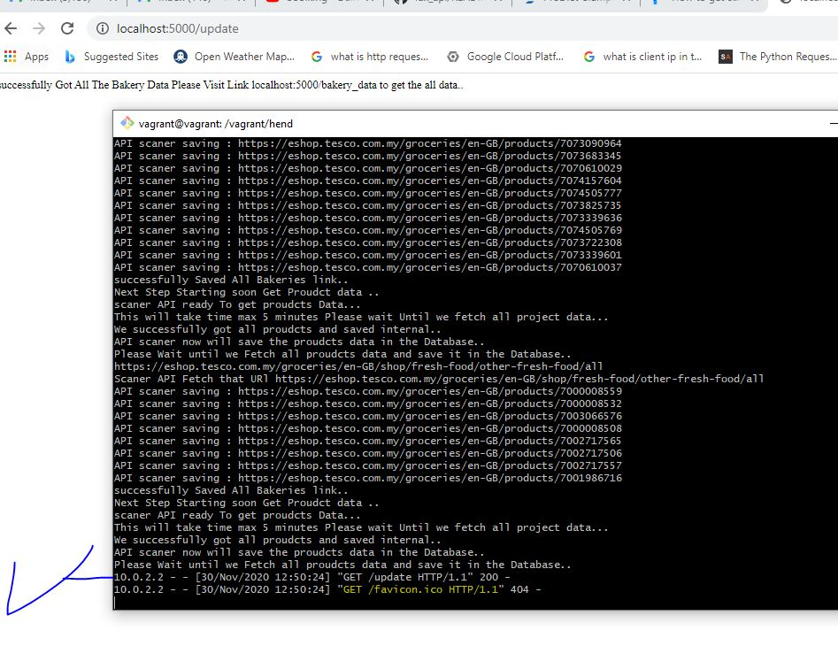

# lux_api

## first step save the appid in your pc 

## How To start local virtual machine and Test This API:
* Download Vagrant
* Download Virtual Box
* IF you are using windows download gitBash else use terminal instead
* if you Could not configure the vagrant to create a machine you will find file called vagrant incloded with project
* install  virtual box and vagrant then open gitbash use cd command to get inside the project folder
* run this command ```shell vagrant up ```
* wait then ```shell vagrant ssh ```
* now you can install pip3 using apt-get install  ```shell sudo apt-get install python3-pip```
* install python3 ```shell sudo apt install [python3] || [python3.7] ```
* install all the modules in the file any error not found seach how to install and copy the name of packge 
* write the command uselly pip3 install packge name
* if you did all steps correct run this command  ``` python3 __init__.py  ```
* open the url localhost:5000/update


# list of all endpoint URL:


### API End Points (Use this to fetch the data)

###### you can find your appid in freelancer.com chat and in what's.

1. [server_ip]:[port_number]/fresh_food/[appid] 
2. [server_ip]:[port_number]/freshfood_links/[appid]
3. [server_ip]:[port_number]/grocery/[appid]
4. [server_ip]:[port_number]/grocery_links[appid]
5. [server_ip]:[port_number]/baby[appid]
6. [server_ip]:[port_number]/baby_links/[appid]
7. [server_ip]:[port_number]/child_and_frozen/[appid]
8. [server_ip]:[port_number]/child_and_frozen_links/[appid]
9. [server_ip]:[port_number]/health_and_beauty/[appid]
10. [server_ip]:[port_number]/health_and_beautyLinks/[appid] 
12. [server_ip]:[port_number]/household/[appid]
13. [server_ip]:[port_number]/household_links/[appid] 
14. [server_ip]:[port_number]/pets/[appid]
15. [server_ip]:[port_number]/pets_links/[appid]


### URL to start scraping Process

##### !please note this url will delete the old database and scrape the new items so do not visit it if you do not need update the data.
##### you can cancel by clicking [CTRL+c]

* http://localhost:5000/update/[appid]

### URL to print the all site data into new file (file_name) enter any file name without extension

* [server_ip]:[port_number]/tesco_excel/[filename]
* http://localhost:5000/tesco_excel/new_file  (example)

###### on the host change localhost:5000/update with your topdomain + /update
###### ! url end with data contain the proudct information, the orther one contains the source url and update time


# summary all packges installed (required step)
* BeautifulSoup
* matplotlib.pyplot
* flask
* sqlalchemy
* sqlalchemy.orm
* postgresql
* Flask
* python-pip3
* python-sqlalchemy
* database_setup
* python3-httplib2
* python3
* pip3
* string
* httplib2
* json
* git
* requests
* pandas
* tablib 
* Dataset 
* numpy 
* excel 
* sklearn.model_selection 
* train_test_split 
* PyPDF2 
* PdfFileReader
* io 
* PdfFileReader 
* collections 
* Counter 
* base64 
* pprint 
* sqlite3
* datetime
* time
* date


## how to know the API finished update

*  ! do not reload the page during the steps
*  

